#Sistemas discretos. Respuesta temporal.

##Introducción
Sea el sistema

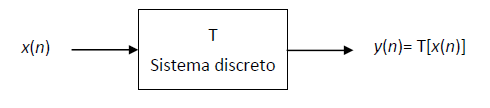

La salida y(n) está relacionada con la entrada x(n) por la siguiente expresión

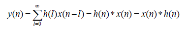

Al no poder ser tratada computacionalmente, usamos la siguiente expresión

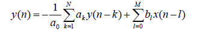

que relaciona la salida del sistema con la entrada pero además con valores pasados de la salida. A partir de esta fórmula podemos dividir los sistemas según la duración de la respuesta impulsiva.

* Sistemas de Respuesta Impulsiva Infinita. Sistemas donde el conjunto de coneficientes {ak} y {bk} no son todos nulos.

* Sistemas de Respuesta Impulsiva Finita. Sistemas donde los valores de los coeficientes {ak} son todos cero, es decir, no hay un vector {ak}.

En esta práctica estudiamos el comportamiento de ambos sistemas.

##Filtro IIR

En este apartado calculamos las respuesta impulsiva del sistema

Para ello usamos en matlab el siguiente código

cuya salida es

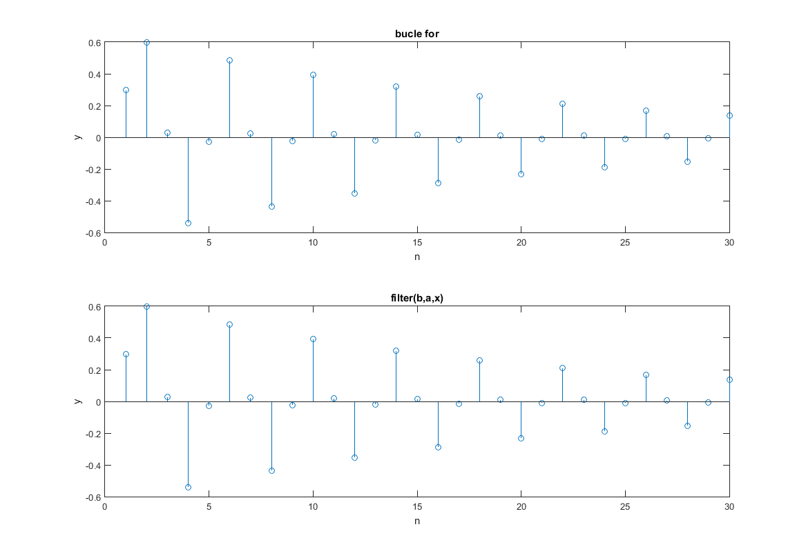

que la hemos comparado con la salida de la función filter(b,a,x). Donde b es el conjunto de coeficientes {bk} y a es el conjunto de coeficientes {ak}.

Como podemos observar la respuesta impulsiva del sistema está acotada y por lo tanto es *estable*.

Ahora probamos con la entrada una señal escalón unitario. En matlab sólo habría que cambiar el vector x por ones(1,30), ya que la señal discreta es 1 para todo n mayor que 1.

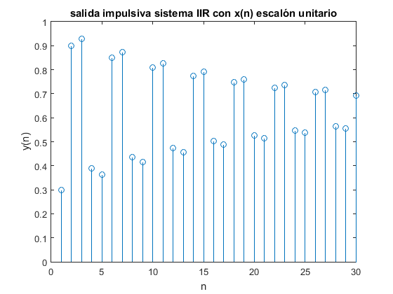

La respuesta impulsiva sigue estando acotada cuando n tiende infinito y podemos decir que el sistema es *estable*.

Ahora probamos con el sistema

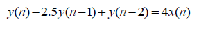

Para ello usamos en matlab el siguiente código

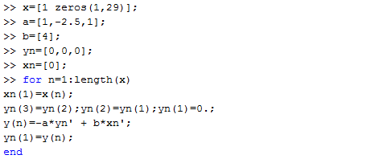

cuya representación de los datos es

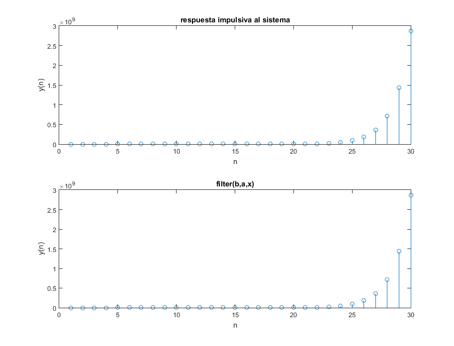

En este caso la respuesta impulsiva del sistema no es estable ya que tiende a infinito.

##Filtro FIR

En este caso probamos un sistema con filtro FIR cuya salida es la media de las últimas 10 muestras de entrada. Para ello usamos el siguiente código de matlab que usa como señal de entrada el escalón unitario

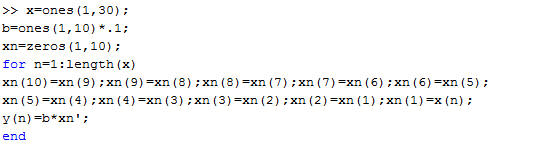

cuya representación es

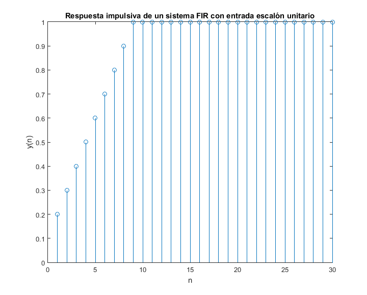

Por último probamos a ver cual es la salida de la función filter con un escalón unitario y lo comparamos con el de de la salida de la función matlab *conv(u,v)*.

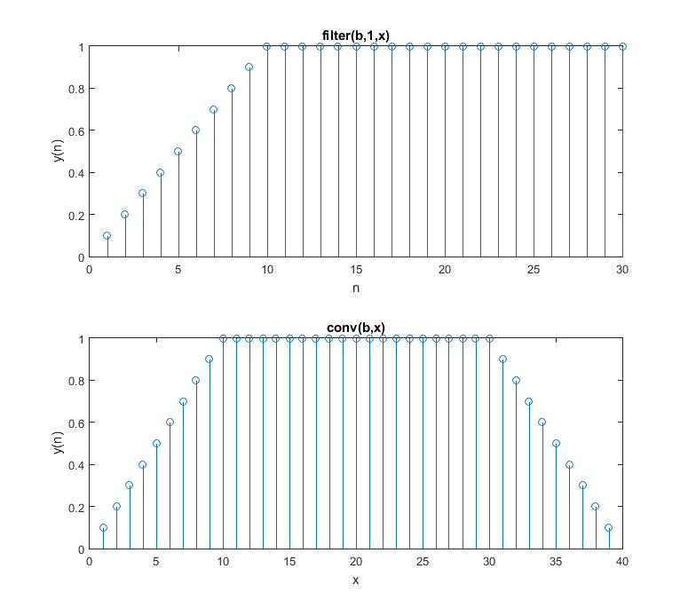

Como podemos ver la función conv obtiene la salida más allá de la muestra 30, haciéndola hasta length(x)+length(b) que son 10 coeficientes, pero a partir de la iteración 31, va rotando a la izquierda el vector una posición y añadiendo un cero en la posición última.
